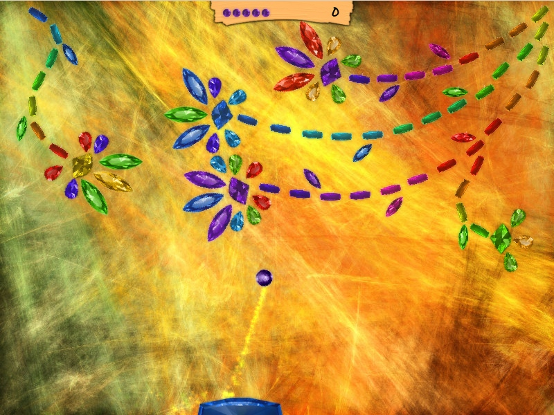
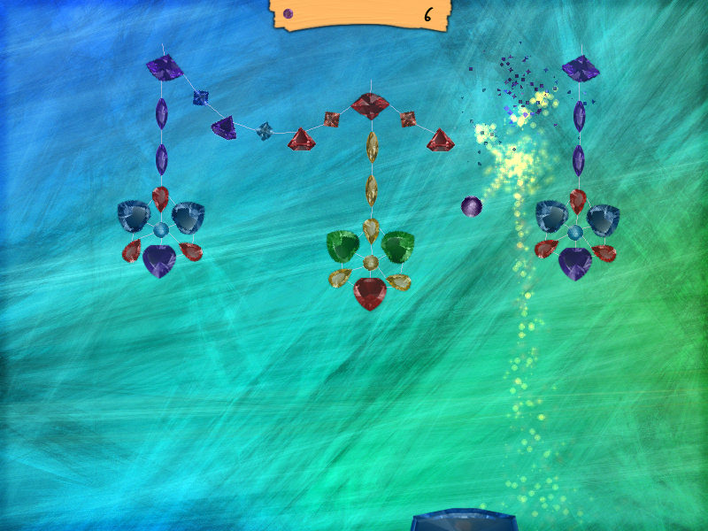
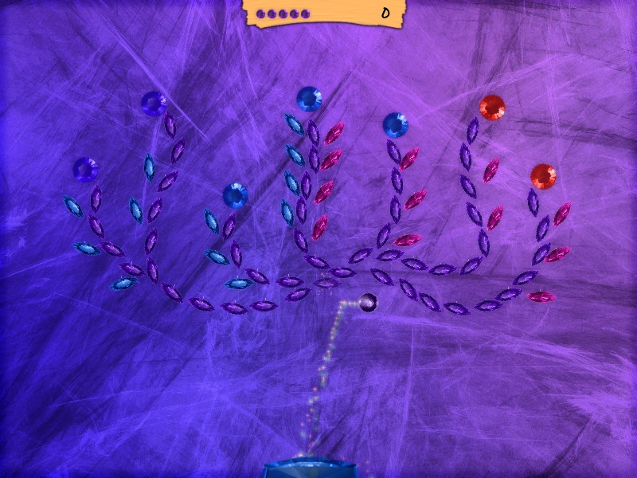
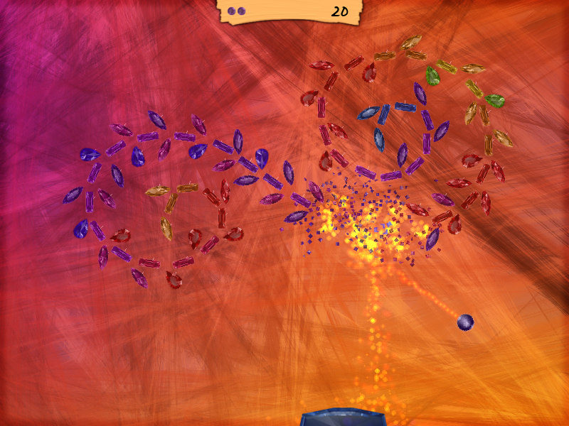
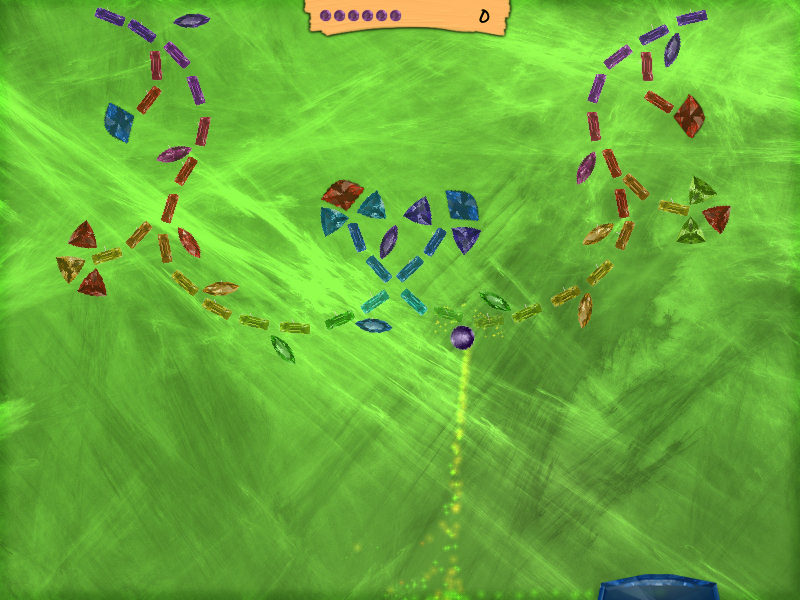
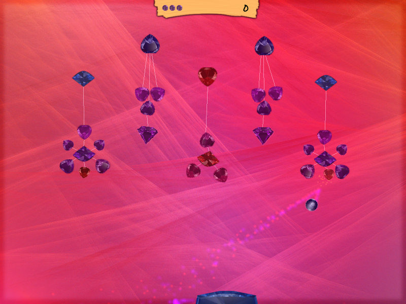
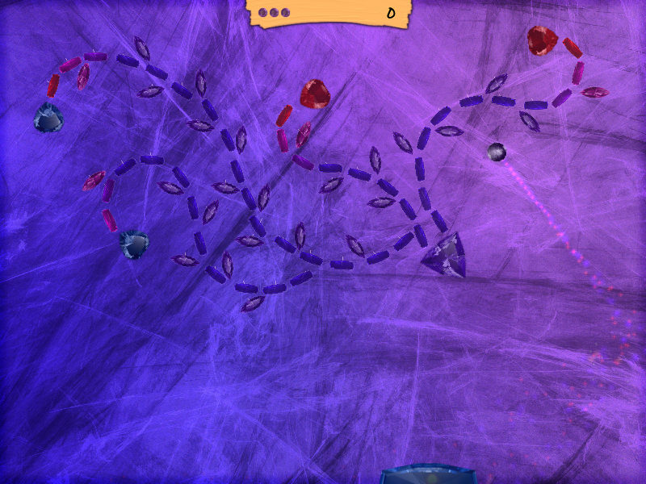
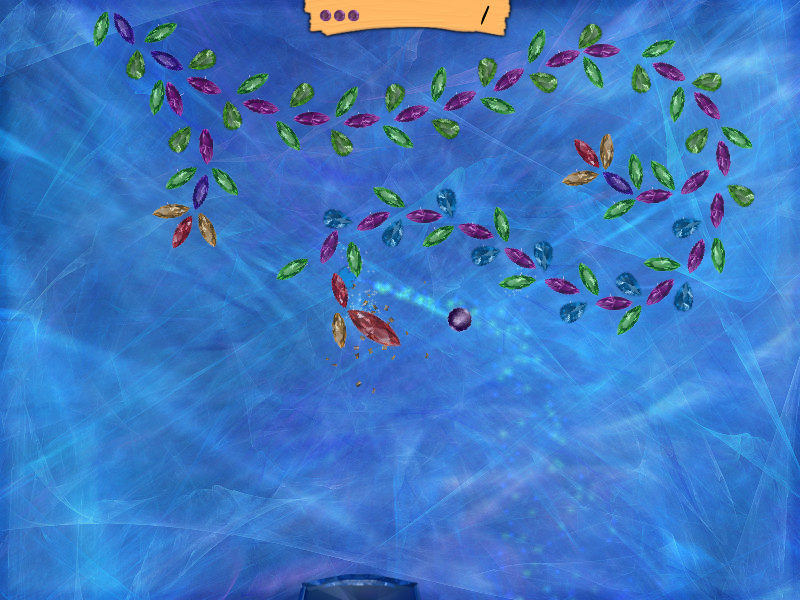

## 
Kinetic Art is a physics-based arcade game made for art's sake back in 2010. Uses [Allegro](http://liballeg.org/) for graphics, [Chipmunk](https://chipmunk-physics.net/) for physics and OGG/Vorbis for audio. Pre-built release is available for Windows.

### More screenshots

  
  
  
  
  
  
  
  

### Youtube

https://www.youtube.com/watch?v=dX43Ka3QnWE

### License

Released into the public domain.
See ``LICENSE`` for more information.

Background music track, ['Loopholes In Time'](https://alonetone.com/author/tracks/loopholes-in-time), is distributed under [CC-BY](https://creativecommons.org/licenses/by/3.0/).

All images are also distrubuted under [CC-BY](https://creativecommons.org/licenses/by/3.0/).
Backgrounds are rendered with [Apophysis](http://www.apophysis.org/), freeware fractal flame editor.
